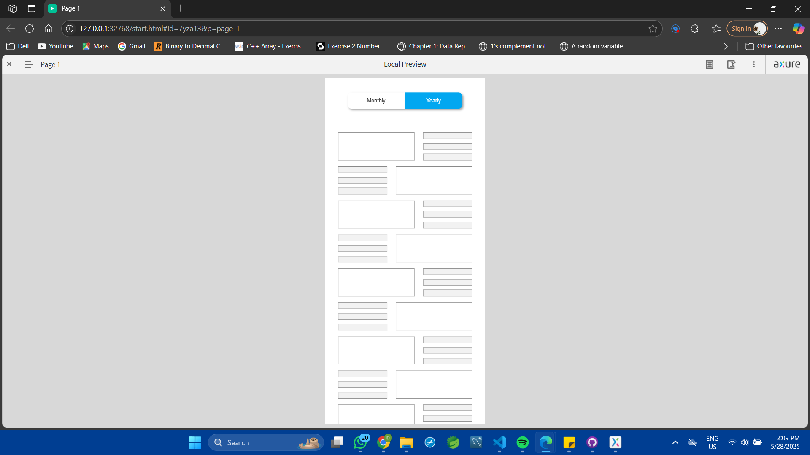
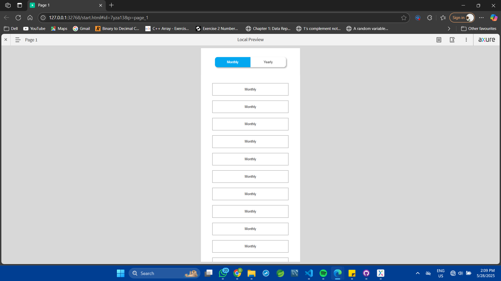

# Axure RP Segment Control - Monthly/Yearly Toggle

A comprehensive guide for creating a segment control component in Axure RP with monthly and yearly view states and dynamic content panels.

## Project Overview

This project demonstrates how to create an interactive segment control using Axure RP that allows users to toggle between monthly and yearly views with corresponding dynamic content panels.

## Components Created

### 1. Segment Control Buttons
- **Monthly Button**: Default selected state with blue background and white text
- **Yearly Button**: Alternate state that toggles with the monthly button
- Both buttons configured as a selection group for exclusive selection

### 2. Dynamic Content Panel
- **State 1 (Monthly)**: Contains sections relevant to monthly view
- **State 2 (Yearly)**: Contains sections relevant to yearly view
- Configured with vertical scrolling capability

## Implementation Steps Completed

### Button Setup
1. ✅ Created two buttons using rectangle widgets (Monthly, Yearly)
2. ✅ Applied selected style to monthly button:
   - Fill color: Blue
   - Font color: White
   - Border width: 0px
3. ✅ Copied and applied consistent styling to yearly button
4. ✅ Set monthly button as default selected
5. ✅ Configured selection group = 1 for both buttons

### Dynamic Panel Configuration
6. ✅ Added dynamic panel widget
7. ✅ Created content sections in State 1 (Monthly)
8. ✅ Enabled vertical scrolling for the panel
9. ✅ Created content sections in State 2 (Yearly)
10. ✅ Renamed panel states:
    - State 1: "monthly"
    - State 2: "yearly"

### Interaction Setup
11. ✅ Configured Monthly button click interaction:
    - Action 1: Set selected/checked → Select monthly button
    - Action 2: Set panel state → "monthly"
12. ✅ Configured Yearly button click interaction:
    - Action 1: Set selected/checked → Select yearly button
    - Action 2: Set panel state → "yearly"
13. ✅ Added hotspot at bottom of scrollable area for proper whitespace handling

## Widget Structure

```
Segment Control Component
├── Monthly Button (Rectangle)
│   ├── Default: Selected state
│   ├── Selection Group: 1
│   └── Click Interaction → Set Monthly State
├── Yearly Button (Rectangle)
│   ├── Selection Group: 1
│   └── Click Interaction → Set Yearly State
├── Dynamic Panel
│   ├── State 1: "monthly"
│   │   └── Monthly Content Sections
│   └── State 2: "yearly"
│       └── Yearly Content Sections
└── Bottom Hotspot (for scroll spacing)
```

## Styling Specifications

### Selected Button Style
- **Fill Color**: Blue (#0066CC or similar)
- **Font Color**: White (#FFFFFF)
- **Border Width**: 0px
- **Border Radius**: As needed for design consistency

### Unselected Button Style
- **Fill Color**: Transparent or light gray
- **Font Color**: Dark gray or black
- **Border**: As per design requirements

## Interaction Flow

1. **Default State**: Monthly button is selected, monthly panel state is active
2. **User clicks Yearly**: 
   - Yearly button becomes selected
   - Monthly button becomes unselected
   - Panel switches to "yearly" state
3. **User clicks Monthly**:
   - Monthly button becomes selected
   - Yearly button becomes unselected
   - Panel switches to "monthly" state

## Key Features

- **Exclusive Selection**: Only one button can be selected at a time
- **Dynamic Content**: Panel content changes based on selected button
- **Vertical Scrolling**: Long content can be scrolled within the panel
- **Proper Spacing**: Bottom hotspot ensures adequate whitespace when scrolling

## Usage Instructions

1. **Preview the prototype** to test the segment control functionality
2. **Click between Monthly and Yearly** buttons to switch views
3. **Scroll within the dynamic panel** to view all content
4. **Observe the selection states** changing with button clicks

## Technical Notes

- **Selection Group**: Both buttons use selection group "1" to ensure mutual exclusivity
- **Panel States**: Named states make it easier to manage and reference in interactions
- **Hotspot Usage**: Bottom hotspot provides better UX for scrollable content
- **Responsive Design**: Consider testing at different viewport sizes


### Testing Checklist
- [ ] Monthly button selects by default
- [ ] Clicking yearly deselects monthly
- [ ] Panel content switches correctly
- [ ] Vertical scrolling works in both states
- [ ] Bottom spacing is adequate
- [ ] Visual feedback is clear for selected state

## Screenshots


